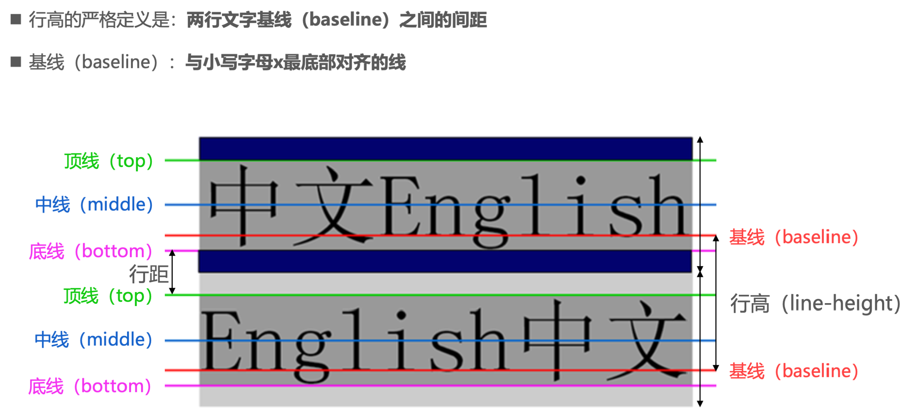
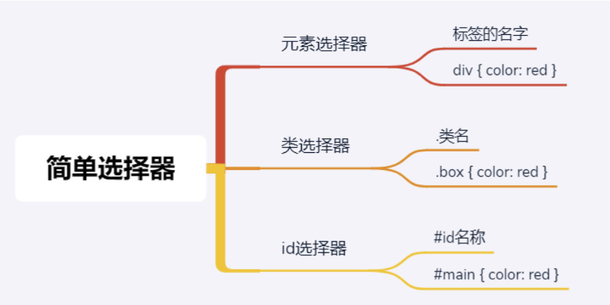
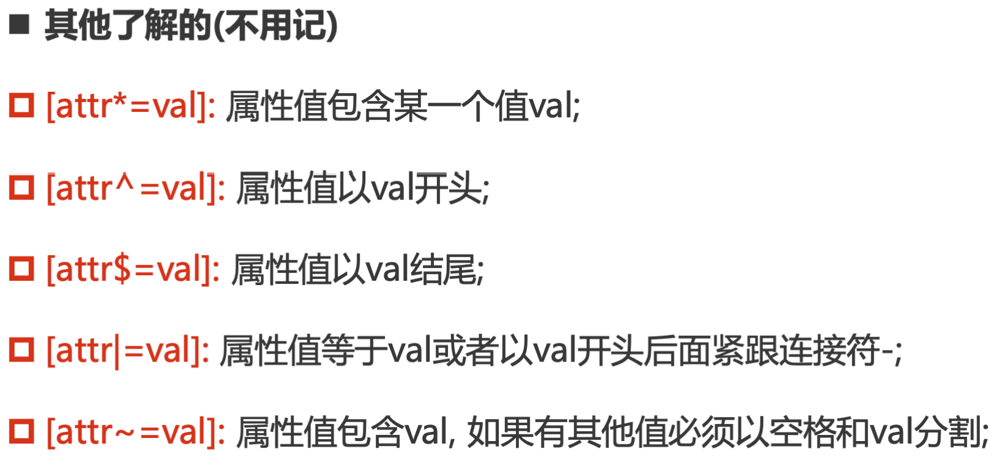
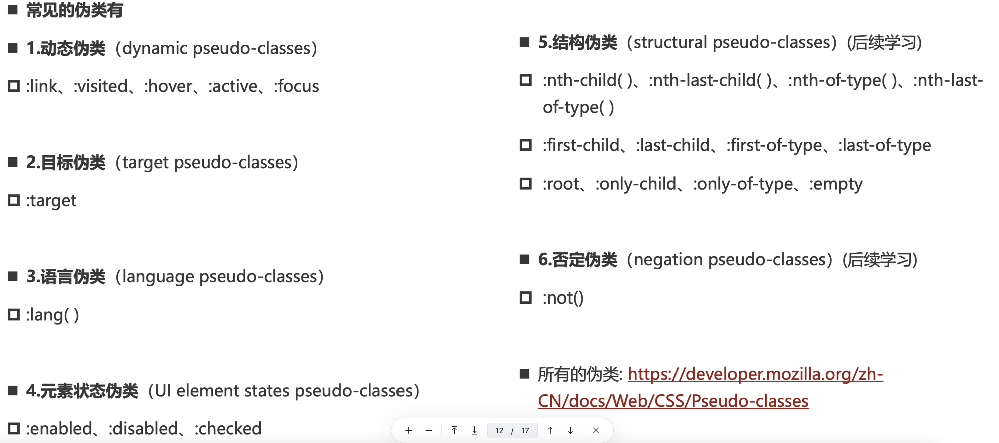

## CSS属性

### 1. 文本属性

#### 1.1 text-decoration:装饰线

```html
<!DOCTYPE html>
<html lang="en">
<head>
    <meta charset="UTF-8">
    <title>文本的装饰线</title>
    <!--
      none: 无任何装饰线
          可以去除a元素默认的下划线
      underline: 下划线
      overline: 上划线
      line-through: 删除线
      -->
    <style>
        .baidu {
            text-decoration: underline;
            cursor: pointer; //鼠标放置,显示手指
        }

        .google {
            text-decoration: line-through; //删除线
        }

        .bing {
            text-decoration: overline; //上面的线,但是一般用border-top
        }

        a {
            text-decoration: none; //a标签的下划线一般会覆盖掉,不显示下划线
        }
    </style>
</head>
<body>
<!--a元素自带text-decoration:underline-->
<a href="http://www.baidu.com">百度</a>
<!--  为span设置下划线,其他的样式,比如点一下之后颜色变化,涉及到伪类的设置  -->
<span class="baidu">百度一下</span>
<span class="google">Google一下</span>
<span class="bing">Bing一下</span>
</body>
</html>

```

#### 1.2 text-transform:大小写

```html
<!DOCTYPE html>
<html lang="en">
<head>
    <meta charset="UTF-8">
    <title>文本大小写(很少使用)</title>
<!--
    不适用中文,这种灵活控制效果一般使用js,而不用css,比如只要求第一个单词首字母大写
    capitalize: 首字母大写,每个单词首字母大写
    uppercase: 每个单词每个字母都大写
    lowercase: 每个单词每个字母都小写
    none: 没有影响
  -->

    <style>
        .info{
            //text-transform: capitalize;
            text-transform: uppercase;
        }
    </style>
</head>
<body>
   <div class="info">my name is lym</div>
</body>
</html>

```

#### 1.3 text-indent:缩进

```html
<!DOCTYPE html>
<html lang="en">
<head>
    <meta charset="UTF-8">
    <title>文本缩进(很少使用)</title>
    <!--
        text-indent用于设置第一行内容的缩进
        一般设置为2em,代表缩进两个字体大小
      -->
    <style>
        .news {

            font-size: 20px;
            /**
                一般设置为字体大小的两倍,所以这里的单位可以用em
                em:相对于字体的大小
            */
            text-indent: 2em;
        }
    </style>
</head>
<body>
<p class="news">大家好，我是程序员盒子网站的作者，也是技术星球的作者，也是你们想在手上拿到的WebChat这个基于WebSocket实现的网页版即时通信小demo项目的作者。
    最近有很多小伙伴都花了一块钱拿到了这个项目源代码，也真心感觉到有很多小伙伴是真真切切从中学到了一些自己所不了解的技术，同时也遇到了很多小伙伴的私信，有关于部署问题的、有关于技术细节的，人太多了，作者一个人根本回复不过来，而且很多问题都是需要重复去解答的，效率极低！正好最近作者上线了技术星球这个社区服务，特此开通了这个关于WebChat技术交流的星球，大家可以在这里统一提问，交流，我会统一回复。

    最后真心希望大家都可以在这个项目中有所收获！

    关于webchat项目包的传送门：https://www.coderutil.com/mall/item?itemId=167069788431873</p>
</body>
</html>

```

#### 1.4 text-align:对齐(重要)

```html
<!DOCTYPE html>
<html lang="en">
<head>
    <meta charset="UTF-8">
    <title>文本对齐(重要)</title>
    <!--
        设置文本对齐的方式
        left/right : 左/右对齐,默认为left
        center: 居中显示
        justify: 两端对齐(需要多行文本,很少使用),最后一行默认左对齐,除非单独设置text-align-last:justify
        实际上,text-align不仅可以让文本居中,也可以让图片之类的元素
        所以在官方中定义text-align为:行内内容相对于块级父元素的对齐方式,所以是行级元素在块级父元素中的对齐方式
    -->
    <style>
        .box{
            background-color: red;
            color: white;
            text-align: center;
            height: 300px;
        }

        .content{
            width: 100px;
            height: 100px;
            background-color: yellow;
            /* ①改成行内级元素就可以 */
            //display: inline-block;
            /* ②左右auto也可以 */
            margin: 0 auto;
        }
    </style>
</head>
<body>
    <div class="box">我是div元素
        <input />
        <div class="content"></div>
    </div>
</body>
</html>

```

#### 1.5 letter/word-spacing:间隙

```html
<!DOCTYPE html>
<html lang="en">
<head>
    <meta charset="UTF-8">
    <title>空隙</title>
    <style>
        .box{
            /*字母之间的空隙*/
            letter-spacing: 10px;
            /*单词之间的空隙*/
            word-spacing: 20px;
        }
    </style>
</head>
<body>
    <div class="box">my name is lym</div>
</body>
</html>

```

### 2. 字体属性

#### 2.1 font-size:大小

```html
<!DOCTYPE html>
<html lang="en">
<head>
    <meta charset="UTF-8">
    <title>字体大小</title>
    <!--
        常用设置:
        1. 具体数值+单位
            100px
            em(不推荐),1em=100%
        2. 百分比
            基于父元素,50%=父元素font-size的50%
     -->
    <style>
        .box {
            /*默认为16px*/
            font-size: 2em;
        }
    </style>
</head>
<body>
<div class="box">我是div</div>
<div class="box2">我是div</div>
</body>
</html>
```

#### 1.2 font-family: 字体名称

```html
<!DOCTYPE html>
<html lang="en">
<head>
    <meta charset="UTF-8">
    <title>字体名称</title>
    <!--
      font-family用于设置文字的字体名称
       可以设置1个或者多个字体名称;
       浏览器会选择列表中第一个该计算机上有安装的字体;
       或者是通过  @font-face 指定的可以直接下载的字体
      -->

    <style>
        body{
            /* 淘宝使用的 */
            font-family: Tahoma,Arial,"Hiragino Sans GB","\5b8b\4f53",sans-serif;
        }
    </style>
</head>
<body>

</body>
</html>

```

#### 1.3 font-weight:字体粗细

```html
<!DOCTYPE html>
<html lang="en">
<head>
    <meta charset="UTF-8">
    <title>字体粗细</title>
    <!--
    font-weight用于设置文字的粗细（重量）
     常见的取值:
        100 | 200 | 300 | 400 | 500 | 600 | 700 | 800 | 900 ：每一个数字表示一个重量
        normal：等于400
        bold：等于700
    strong、b、h1~h6等标签的font-weight默认就是bold
  -->
    <style>
        .content{
            font-weight: 100;
        }
    </style>
</head>
<body>
    <p class="content">strong、b、h1~h6等标签的font-weight默认就是bold</p>
    <b>b</b>
    <strong>strong</strong>
</body>
</html>
```

#### 1.4 font-style: 文本常规/斜体

```html
<!DOCTYPE html>
<html lang="en">
<head>
    <meta charset="UTF-8">
    <title>文字常规/斜体</title>
    <!--     font-style用于设置文字的常规、斜体显示
    ◼       normal：常规显示
    ◼       italic(斜体)：用字体的斜体显示(通常会有专门的字体)
    ◼       oblique(倾斜)：文本倾斜显示(仅仅是让文字倾斜)  -->
    <style>
        p{
            font-style: oblique;
        }
    </style>
</head>
<body>
<!-- ◼       em、i、cite、address、var、dfn等元素的font-style默认就是italic   -->
<em>hello</em>
<p>hello</p>
</body>
</html>

```

#### 1.5 font-variant:小写字母变形

```html
<!DOCTYPE html>
<html lang="en">
<head>
    <meta charset="UTF-8">
    <title>小写字母变形</title>
    <!--  
      可以设置的值如下
      normal：常规显示
      small-caps：将小写字母替换为缩小过的大写字母
     -->
    <style>
        p{
            font-variant: small-caps;
        }
    </style>
</head>
<body>
    <p>abcABC</p>
</body>
</html>
```

#### 1.6 line-height: 行高



### 3.选择器

> 按照一定的规则选出符合条件的元素，为之添加CSS样式
>
>  通用选择器（universal selector）
>          元素选择器（type selectors）
>          类选择器（class selectors）
> 		  id选择器（id selectors）
> 		  属性选择器（attribute selectors）
> 		  组合（combinators）
> 		  伪类（pseudo-classes）
> 		  伪元素（pseudo-elements）

#### 3.1 通用选择器

一般用来给所有元素作一些通用性的设置

```html
<!DOCTYPE html>
<html lang="en">
<head>
    <meta charset="UTF-8">
    <meta http-equiv="X-UA-Compatible" content="IE=edge">
    <meta name="viewport" content="width=device-width, initial-scale=1.0">
    <title>Document</title>
    <style>
        /* * {
          font-size: 30px;
          background-color: #f00;
        } */

        /* div {
          background-color: #f00;
        } */

        /* 更推荐的做法 */
        body, p, div, h2, span {
            margin: 0;
            padding: 0;
        }
    </style>
</head>
<body>

<div>我是div元素</div>
<p>我是p元素</p>

<div>
    <h2>我是h2元素</h2>
    <p>我也是p元素  <span>呵呵呵呵</span> </p>
</div>

</body>
</html>
```

#### 3.2 简单选择器



```html
<!DOCTYPE html>
<html lang="en">
<head>
    <meta charset="UTF-8">
    <meta http-equiv="X-UA-Compatible" content="IE=edge">
    <meta name="viewport" content="width=device-width, initial-scale=1.0">
    <title>Document</title>
    <style>
        div {
            color: red;
        }

        .box {
            color: blue;
        }

        #home {
            color: green;
        }
    </style>
</head>
<body>
<!-- 强调: 在同一个HTML文档中, id不要重复, 应该是唯一 -->

<div>我是div1</div>
<div class="box">我是div2</div>
<div id="home">我是div3</div>

<p class="box">我是p元素</p>

<h2 id="div">我是h2标题</h2>

<!-- class/id的名称比较复杂 -->
<div class="box one"></div>
<div class="box-one box-first"></div>
<div class="box_one box_first"></div>
<!-- 大驼峰/小驼峰 -->
<!-- <div class="boxOne BoxFirst"></div> -->

</body>
</html>
```

#### 3.3 属性选择器

>  拥有某一个属性  [att]
> 		  属性等于某个值 [att=val]
>
> 

```html
<!DOCTYPE html>
<html lang="en">
<head>
    <meta charset="UTF-8">
    <meta http-equiv="X-UA-Compatible" content="IE=edge">
    <meta name="viewport" content="width=device-width, initial-scale=1.0">
    <title>Document</title>
    <style>
        [title] {
            color: red;
        }

        [title=div] {
            background-color: blue;
        }
    </style>
</head>
<body>

<div>我是div元素</div>
<div title="div">我也是div元素</div>
<p>我是p元素</p>
<h2 title="h2">我是h2元素</h2>

</body>
</html>
```

#### 3.4 后代选择器

> 1. 所有后代  `父选择器 子选择器`
> 2. 直接后代 `父选择器>子选择器`

```html
<!DOCTYPE html>
<html lang="en">
<head>
    <meta charset="UTF-8">
    <meta http-equiv="X-UA-Compatible" content="IE=edge">
    <meta name="viewport" content="width=device-width, initial-scale=1.0">
    <title>Document</title>
    <style>
        /* 后代选择器 */
        .home span {
            color: red;
            font-size: 30px;
        }

        /* .home的子代的span元素设置一个背景 */
        .home > span {
            background-color: green;
        }
    </style>
</head>
<body>

<div class="home">
    <span>啦啦啦啦</span>
    <div class="box">
        <p>我是p元素</p>
        <span class="home-item">呵呵呵呵</span>
    </div>

    <div class="content">
        <div class="desc">
            <p>
                <span class="home-item">哈哈哈哈</span>
            </p>
        </div>
    </div>
</div>

<!-- 不希望被选中 -->
<span>嘻嘻嘻</span>
<div>
    <span>嘿嘿嘿</span>
</div>

</body>
</html>
```

#### 3.5 兄弟选择器

> 1. 相邻一个兄弟选择 `选择器+兄弟`
> 2. 所有兄弟选择 `选择器~兄弟`

``` html
<!DOCTYPE html>
<html lang="en">
<head>
    <meta charset="UTF-8">
    <meta http-equiv="X-UA-Compatible" content="IE=edge">
    <meta name="viewport" content="width=device-width, initial-scale=1.0">
    <title>Document</title>
    <style>
        .box + div {
            color: red;
        }

        .box ~ div {
            font-size: 30px;
        }
    </style>
</head>
<body>

<div class="home">
    <div>叽叽叽叽</div>
    <div class="box">呵呵呵呵</div>
    <div class="content">哈哈哈哈</div>
    <div>嘻嘻嘻嘻</div>
    <div>嘿嘿嘿嘿</div>
    <p>我是p元素</p>
</div>

</body>
</html>
```

#### 3.6 交集选择器

> 在开发中通常为了精准的选择某一个元素

```html
<!DOCTYPE html>
<html lang="en">
<head>
    <meta charset="UTF-8">
    <meta http-equiv="X-UA-Compatible" content="IE=edge">
    <meta name="viewport" content="width=device-width, initial-scale=1.0">
    <title>Document</title>
    <style>
        div.box {
            color: red;
            font-size: 30px;
        }
    </style>
</head>
<body>

<div class="box">我是div元素</div>
<p class="box">我是p元素</p>

</body>
</html>

```

#### 3.7 伪类

`Pseudo-classes`翻译过来就是伪类,伪类是选择器的一种，它用于选择处于特定状态的元素;



##### 3.7.1 动态伪类

>  a:link 未访问的链接
>          a:visited 已访问的链接
>          a:hover 鼠标挪动到链接上(重要)
>          a:active 激活的链接（鼠标在链接上长按住未松开）
>
> :hover必须放在:link和:visited后面才能完全生效
>
> :active必须放在:hover后面才能完全生效
>
> 建议的编写顺序是  :link、:visited、:hover、:active
>
> 除了a元素，:hover、:active也能用在其他元素上

另外还有一个常见的动态伪类:`:focus`指当前拥有输入焦点的元素,因为链接a元素可以被键盘的Tab键选中聚焦，所以:focus也适用于a元素.最终编写伪类的顺序为:`:link、:visited、:focus、:hover、:active`