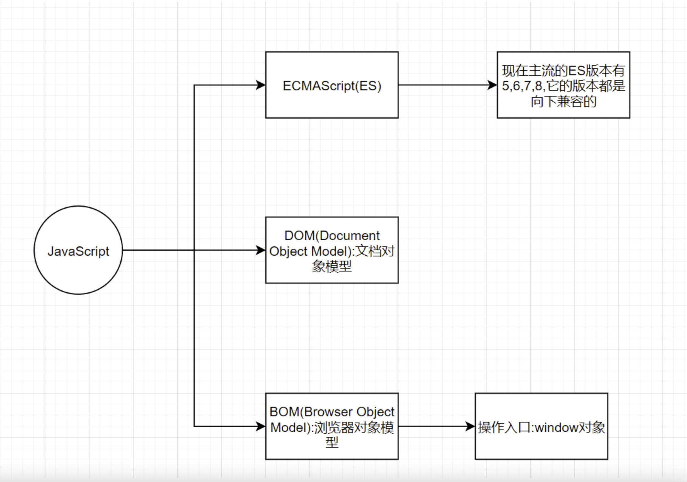

## JavaScript第一节课

### 1. 前置

前端一般分为3部分

1. 结构层: `HTML` 作用是放置页面的组件
2. 样式层:`CSS` 作用就是美化页面,实现布局
3. 行为层:`JavaScript(JS)` 作用就是实现各种交互效果

另外一个常见的术语为`ECMAScript`

ECMAScript是JavaScript的规范.类比Java的类,ECMAScript可以理解为接口,而javaScript可以理解为它的实现



### 2. JS基础语法

#### 2.1 变量

```java
<script>
    // js单行注释
    /*
    * 多
    * 行
    * 注
    * 释
    */
    /**
     * 多行注释2
     */
 
    //js是弱类型语言,使用var关键字来声明变量
    var i =1+2
    var j = 0
    var k = i+j
    var h = '哈哈'
    // System.out.println()输出信息到控制台
    //console.log()输出信息到控制台
    console.log("k=="+k)
    console.log(h)
    /**
     * js中变量命名规范
     * 1.变量名必须使用字母,下划线或美元符号开头,不推荐使用中文
     * 不要包含特殊符号
     */
    // var 1muzi = "muzi"  报错
    // var i+j = 1 报错
    var 数字 = 1  //不推荐,但是不报错
    /**
     * 2. js是大小写敏感的
     * 下列的例子是两个变量
     */
    var muzi  = 'muzi'
    var muZi = 'muzi'
    /**
     * 3, 不能使用关键字作为变量名
     */
    // var var = 1 错误,关键字不能为变量名
    //推荐使用小驼峰命名法,和java一样
    //每一句代码后可以不加分号,也可以加,看个人习惯
</script>
```

#### 2.2 数据类型

> 以ES5为标准

1. 值类型
   1. 字符串
   2. 布尔
   3. 数字
   4. null
   5. undefined
2. 引用类型
   1. 对象
   2. 函数
   3. 数组

##### 2.2.1 字符串

```js
<script>
    /**
     * 字符串使用单引号或者双引号包裹都可以
     */
    var str1 = '我是字符串'
    var str2 = "我也是字符串"
    console.log(str1)
    console.log(str2)
    //js中也支持转义字符,下面的例子就是赋值一个单引号
    var str3 = '\''
    console.log(str3)
</script>
```

##### 2.2.2 数值

```java
<script>
    /**
     * 字符串使用单引号或者双引号包裹都可以
     */
    var str1 = '我是字符串'
    var str2 = "我也是字符串"
    console.log(str1)
    console.log(str2)
    //js中也支持转义字符,下面的例子就是赋值一个单引号
    var str3 = '\''
    console.log(str3)
    console.log('--------------------')
    var num1 = 1
    var num2 = .5
    console.log(num1)
    console.log(num2)
    /**
     * js中使用64位的浮点数,即使存储整数也是用浮点数表示
     * 范围为[-2^53~2^53]
     */
    var num3 = 9999999999999999999999999999999999999999999999999999999999999999999999999999999999999999999999999999999999999999999999999999999999999999999999999999999999999999999999999999999999999999999999999999999999999999
    var num4 = num3*num3*999999999
    //超过范围,直接输出Infinity表示正无穷大
    console.log("num4="+num4)
    var num5 = num3*num3*-999999999
    //超过范围,直接输出-Infinity表示负无穷大
    console.log("num5="+num5)
 
    //js用数字表示二进制(数字0b打头)
    var num6 = 0b110111
    console.log("num6="+num6)
    //js用数字表示八进制(数组0打头)
    var num7 = 067
    console.log("num7="+num7)
    //js用数字表示十六进制(数组0x打头)
    var num8 = 0x37
    console.log("num8="+num8)
</script>
```

##### 2.2.3 布尔

和java一样,有true和false两种布尔类型的值

##### 2.2.4 null,undefined,NaN

- undefined:代表没有定义的值
- null:代表空,一般是对空对象的引用
- NaN:代表非数值

```java
console.log('--------------------')
var muzi
console.log(muzi) //undefined
//typeof 用来返回对应变量或值的类型
console.log(typeof open);
console.log(typeof str1);
console.log(typeof num1);
console.log(typeof num2);
console.log('--------------------')
//null和undefined 值是一样的,但是类型在js里面不一样
console.log(typeof null); //object
console.log(typeof undefined); //undefined
 
var muzi2 = 0/0
console.log(muzi2) //NaN
console.log(typeof muzi2); //number
console.log(typeof NaN); //number
```

> 1/0在js中不会报错,也不会返回NaN,而是认为0是趋近于0,所以返回是Infinity

##### 2.3.5 函数

```js
console.log('--------------------')
 
/* function 函数名(参数){
     函数体
     return 返回值
}*/
//定义函数
function fun1(){
     console.log("函数被调用了")
}
//调用函数
//如果用变量去接受一个没有返回值的函数调用,得到undefined
var result = fun1()
console.log(result) //undefined
 
function fun2(arg1,arg2){
     var sum = arg1+arg2
     console.log("arg1+arg2="+sum)
     return sum
}
 
var result2 = fun2(1,9)
console.log(result2)
```

##### 2.3.6 对象

```java
// var obj = {属性名1:属性值1,属性名2:属性值2.....}
var student = {
    name:'木子',
    age:18,
    study:function () {
        console.log("学生开始学习了")
    }
}
console.log(student)
console.log(typeof student);
//通过对象访问属性
console.log("学生姓名:"+student.name);
console.log("学生年龄:"+student.age);
//通过对象调用函数
student.study()
```

---

##### 2.3.7 数组

```java
//js中数组的元素和java一样,通过[]包裹
var arr1 = [1,2,3,4,5,6]
//和java一样,访问数组元素,也是通过下标访问,下标也是从0开始
console.log(arr1[0]);
console.log(arr1[1]);
console.log(arr1.length);
//原生js forEach接收一个函数,里面的函数
//  第一个参数是每次遍历拿到的值
//  第二个参数是每次遍历的下标
// arr1.forEach(function (item,index) {
//     console.log(index+"==>"+item)
// })
 
//如果只传一个参数,这个参数拿到的是每次遍历的值
arr1.forEach(function (item) {
    console.log("==>"+item)
})
```
