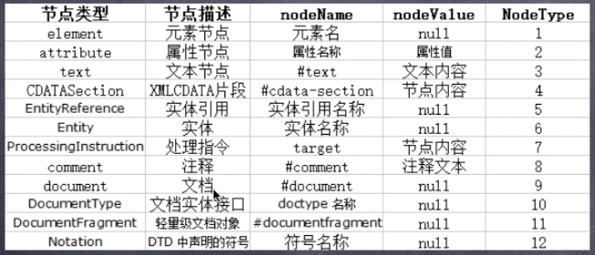
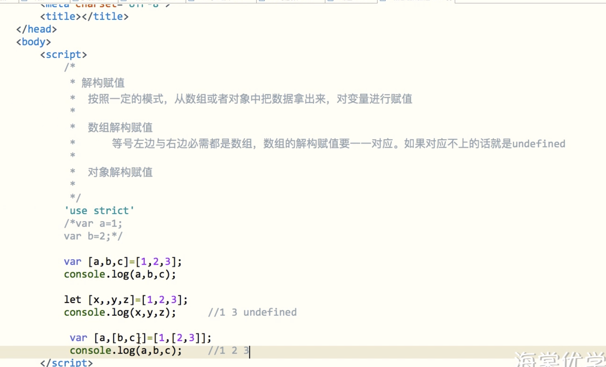
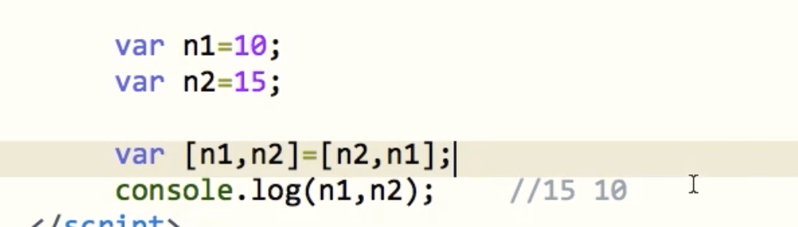
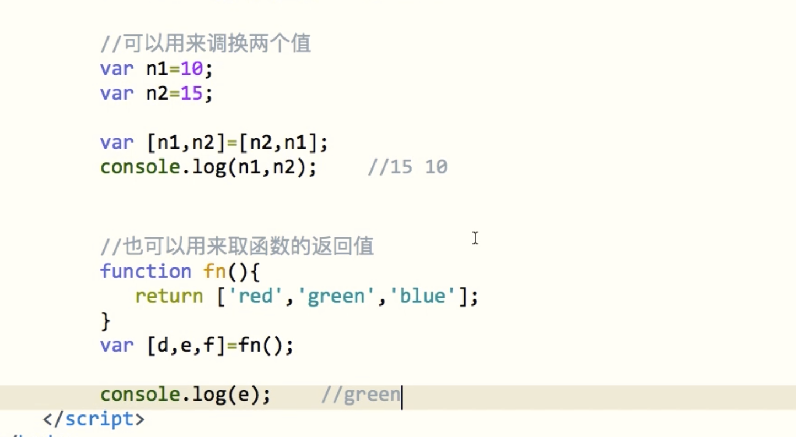

## JS第三节课

> DOM

### 1. DOM

#### 1.1 概念

```javascript
<script>
 	/*
	* DOM
	* 	文档对象模型
	* 	DOM是关于创建，插入，修改，删除页面元素的标准
	* 	DOM赋予我们操作页面的能力
	* 	
	* 	页面的内容都是字符串，JS会把这些字符串转成DOM树，DOM树会把字符串转成节点，其实我们操作DOM的根本就是操作节点
  */	
  </script>
```

```javascript
<body>
		<div id="box" class="color" style="width: 100px;">
			<p><span></span></p>
			softeem
			<!--这里是注释-->
		</div>
</body>
	<script>
		/*
         * arrtibutes
         * 	属性节点
         * 	返回元素身上的所有属性节点，每个属性都会有一个自己对应的下标
         * 	它有一个length属性，代表元素身上有多少个属性节点
         *
         * childNodes
         * 	元素身上的第一层子节点，返回元素身上的所有子节点的集合（第一层）
         *
         * nodeName
         * 	节点的名称
         *
         * nodeType
         * 	节点的类型
         * 	返回的是一个数字
         *
         */
		// window.onload=function(){
		var box=document.getElementById("box");
		console.log(box)
		var attr=box.attributes;		//元素属性节点的集合
		console.log(attr);
		console.log(attr[0]);		//id="box"
		console.log(attr['class']);		//id="box"

		var child=box.childNodes;	//元素子节点的集合
		console.log(child);

		//元素节点（标签）
		console.log(box.nodeName);		//DIV
		console.log(box.nodeType);		//1

		//属性节点
		console.log(attr[0].nodeName);	//id
		console.log(attr[0].nodeType);	//2

		//文本节点
		console.log(child[0].nodeName);	//#text
		console.log(child[0].nodeType);	//3

		//注释节点
		console.log(child[3].nodeName);	//#comment
		console.log(child[3].nodeType);	//8

		//文档节点
		console.log(document.nodeName);	//#document
		console.log(document.nodeType);	//9
		// }
	</script>
```



```javascript
<body>
   <script>
      /*
       * nodeName
       *     节点名称，任何一个节点都有这个属性
       * 
       * tagName
       *     标签名称
       *     只有元素节点才有这个属性
       */
      window.onload=function(){
         var box=document.getElementById("box");       //元素节点
         
         console.log(box.nodeName);    //DIV
         console.log(box.tagName);     //DIV
         
         console.log(document.nodeName);    //#document
         console.log(document.tagName); //undefined
      }
   </script>
   <div id="box"></div>
</body>
```

#### 1.2 JS的位置

上述的代码,如果js放在div之前,则代码会报错,是因为常规情况下,代码是`从上到下`解析运行的,在页面的元素还没定义之前,就尝试用js获取元素,是拿不到的.所以这种情况限制了js的位置,下面聊聊js的分类和位置

##### 1.2.1 内嵌js

之前接触的在html中直接出现的Script标签中直接写的js,被称为内嵌js

##### 1.2.2 外链js

有专门的js后缀的文件,可以和css文件一样,做外链

```javascript
<body>
		<div id="box" class="color" style="width: 100px;">
			<p><span></span></p>
			softeem
			<!--这里是注释-->
		</div>
    <script src="myjs1.js"></script>
</body>
```

回到最开始的问题,如果js写在页面之前怎么保证里面的内容正常运行

```javascript
/*
 * 解决
 *  window.onload     页面加载完成
 *  window.onload=function(){
 *   //当页面中的元素全部加载完成后执行这里的代码
 *  }
 *
 * window.onload什么时候用？
 * 	当js代码需要获取页面中的元素的时候，如果这script放在元素的前面，那就需要加window.onload
 * 	如果script是放在了元素后面，那就不需要加window.onload
 */

```

#### 1.3 选择器

##### 1.3.1 id选择

`document.getElementById('id名')`

```javascript
<head>
    <meta charset="UTF-8">
    <title></title>
    <script>
        /*
         * document.getElementById(id名称)
         *     通过id名称去获取一个元素,它只有一个主语,document(整个文档)
         */
        window.onload = function () {
            var students = document.getElementById('students');
      			//dir可以打印树中的属性和函数
            console.dir(students);
            console.log(students)
            // students.style.background = 'red'

            console.log('------------')
            //如果出现多个id相同的元素,只会取到第一个
            var muzi = document.getElementById('muzi');
            console.log(muzi)

        };
    </script>
</head>
<body>
<ul id="students">
    <li id="muzi">木子</li>
    <li id="muzi">锤子</li>
    <li>斧子</li>
    <li>刀子</li>
    <li>刷子</li>
</ul>
</body>
```

##### 1.3.2  标签选择

`document.getElementsByTagName`/`父级.getElementsByTagName`

```javascript
<head>
   <meta charset="UTF-8">
   <title></title>
   <script>
      /*
       * document.getElementById(id名称)
       *     通过id名称去获取一个元素,它只有一个主语,document(整个文档)
       *
       * getElementsByTagName(标签名称)
       *     通过标签名称去获取一组元素，它获取到的是一组元素
       *     主语(限制范围)：
       *        document         从整个文档中去获取一组元素
       *        父级          从父级下面去获取一级元素
       *
       *     获取到的是一个集合，类数组
       *     类数组：类似数组，但是数组中的一些方法，它没有
       *           它只具备数组中的length属性，以及每个数据都会有一个自己对应的下标
       *
       *     怎么取其它一个元素
       *        用下标的方法去获取其中一个元素
       *
       *
       */

      window.onload=function(){
         var lis=document.getElementsByTagName('li');
         console.log(lis)
         console.dir(lis);

         lis[2].style.background='red';

         var color=document.getElementById('color');       //父级
         //可以使用父级元素调用该方法
         var lis1=color.getElementsByTagName('li');

         console.dir(lis1);
         //通过下标或者item方法
         console.log(lis1.item(1));
      };
   </script>
</head>
<body>
   <ul id="color">
      <li>red</li>
      <li>green</li>
      <li>blue</li>
      <li>yellow</li>
      <li>pink</li>
   </ul>
   <ul>
      <li>red</li>
      <li>green</li>
      <li>blue</li>
      <li>yellow</li>
      <li>pink</li>
   </ul>
</body>
```

##### 1.3.3  类名选择

`document.getElementsByClassName`/`父级.getElementsByClassName`

```javascript
<head>
   <meta charset="UTF-8">
   <title></title>
   <script>
      /*
       * getElementsByClassName(class名称)
       *     通过class去获取到一组元素
       *     获取到的结果也是一个类数组
       *
       * 主语
       *        document      从整个文档里去获取class元素
       *        父级       从父级下去获取class元素
       *
       */
      window.onload=function(){
         var greens=document.getElementsByClassName('green');
         for (let i = 0; i < greens.length; i++) {
            console.log(greens[i])
         }
         console.log('-----------')

         console.dir(greens);

         var color=document.getElementById('color');
         //也可以用父级元素调用
         var greens1=color.getElementsByClassName('green');

         console.dir(greens1);
      };
   </script>
</head>
<body>
   <ul id="color">
      <li>red</li>
      <li class="green">green1</li>
      <li>blue</li>
      <li>yellow</li>
      <li>pink</li>
   </ul>
   <ul>
      <li>red</li>
      <li class="green">green2</li>
      <li>blue</li>
      <li>yellow</li>
      <li>pink</li>
   </ul>
</body>
```

---

##### 1.3.4 css选择器(单个)

`document.querySelector`/`父级.querySelector`

```javascript
<head>
   <meta charset="UTF-8">
   <title></title>
   <style>

      #color{
         background: blue;
      }

      /*#color>li:first-child{*/
      /* background: #f00;*/
      /*}*/

   </style>
   <script>
      /*
       * querySelector(css选择器)
       *     通过css选择器去获取一个元素
       *     它获取到的只有一个元素，如果说有重复的，那它只取第一个
       *
       * 主语
       *        document         从整个文档里去获取元素
       *        父级          从父级里去获取元素
       *
       */

      window.onload=function(){

         var element = document.querySelector('#color');

         console.log(element)
         element.style.background='red'

         var red=document.querySelector('#color li:first-child');
         console.log(red)
         // red.style.background='red';
         //
         // var ul=document.querySelector('.color2');
         // ul.style.background='yellow';
         //
         // var ul=document.querySelector('.green');
         // ul.style.background='pink';
      };
   </script>
</head>
<body>
   <ul id="color">
      <li>red</li>
      <li class="green">green</li>
      <li>blue</li>
      <li>yellow</li>
      <li>pink</li>
   </ul>
   <ul class="color2">
      <li>red</li>
      <li class="green">green</li>
      <li>blue</li>
      <li>yellow</li>
      <li>pink</li>
   </ul>
</body>
```

##### 1.3.5 css选择器(多个)

`document.querySelectorAll`/`父级.querySelectorAll`

```javascript
<head>
   <meta charset="UTF-8">
   <title></title>
   <style>
      /*#color>li:first-child{
         background: #f00;
      }

      #color>li:nth-child(4){
         background: yellow;
      }*/
   </style>
   <script>
      /*
       * querySelectorAll(css的选择器)
       *     通过css选择器获取到一组元素
       *     它获取到的也是一组元素，它也是一个类数组
       *
       * 主语
       *        document         从整个页面中去获取一组元素
       *        父级          从父级下去获取一组元素
       *
       */
      window.onload=function(){
         var lis=document.querySelectorAll('li');
         var li = document.querySelector('li');
         console.dir(lis);
         console.dir(li)

         console.log('----------')
         var color=document.getElementById('color');
         var lis1=color.querySelectorAll('li');
         var lis2=document.querySelectorAll('#color li');

         console.dir(lis1);
         console.dir(lis2);

         var lis3=document.querySelectorAll('#color ul li');
         console.dir(lis3);
         lis3[lis3.length-1].style.background='gold';
         //
         var greens=document.querySelectorAll('.green');
         console.dir(greens);
         greens[0].style.background='green';
         // greens.style.background='green'; //报错
         
         var uls=document.querySelectorAll('ul');
         console.dir(uls);
         uls[2].style.background='blue';
      };
   </script>
</head>
<body>
   <ul id="color">
      <li>red</li>
      <li class="green">green</li>
      <li>blue</li>
      <li>yellow</li>
      <li>
         <ul>
            <li>pink</li>
            <li>white</li>
            <li>black</li>
            <li>gold</li>
         </ul>

      </li>
   </ul>
   <ul class="color2">
      <li>red</li>
      <li class="green">green</li>
      <li>blue</li>
      <li>yellow</li>
      <li>pink</li>
   </ul>
</body>
```

---

#### 1.4 属性操作

##### 1.4.1 id,value,自定义属性

```javascript
<head>
   <meta charset="UTF-8">
   <title></title>
</head>
<body>
   <input type="button" id="btn" value="按钮" style="width: 100px; height: 50px; background: #f00; font-size: 20px;" muzi="18"/>
   <script>
      /*
       * 属性操作方式
       *     1、.    的
       *        元素.属性名
       *        如果属性是单一属性，用点操作符是取不到的，而且还会报错
       *        如果想用点操作符去获取带横杠的属性，那首先要把横杠去掉，然后把横杠后面的第一个字母大写
       *     2、[]   的
       *        如果属性中带横杠，用[]的方式去操作属性
       */

      var btn=document.getElementById('btn');
      console.log(btn)
      btn.onclick=function(){
         console.log(btn.type);    //button
         console.log(btn.id);      //btn
         console.log(btn.value);    //按钮

         btn.value='小按钮';      //修改属性
				 // font是复合属性,size是单一属性
         // font-size    这个属性不能用点直接去获取，因为js不谁横杠
         // console.log(btn.style.font-size);

         console.log(btn.style['font-size']);      //20px

         console.log(btn.style.fontSize);      //20px

         console.log(btn['id']);    //btn

         //获取自定义属性,不能直接通过 节点.属性名
         console.log(btn.muzi) //undefined
         console.log(btn.getAttribute("muzi")) //18
         //自带的属性也可以使用getAttribute方法获取
         console.log(btn.getAttribute('id'))
      };
   </script>
</body>
```

##### 1.4.2 className

```javascript
<div class="kaivon" id="kaivon"></div>
<script>
   /*
    * className
    * 注意：class是js中的一个保留字。它是不允许我们用的
    *        在获取class的时候，不能用class，用className
    */
   var kaivon=document.getElementById('kaivon');
   
   console.log(kaivon.class);    //undefined
   console.log(kaivon.className); //kaivon
</script>
```

##### 1.4.3 innerHtml

```javascript
<body>
   <script>
      /*
       * innerHTML
       *     获取到是一个标签对里的所有内容
       *     如果标签对当中有其它的标签，那一样会拿的到
       * 
       * 在给innerHTML设置值的时候，如果这个值里面有html标签，那放到网页当中，会把它解析成一个真正的html标签
       */
      window.onload=function(){
         var btn=document.getElementById('btn');
         var box=document.getElementById('box');
         
         btn.onclick=function(){
            console.log(box.innerHTML);    
            
            //设置
            box.innerHTML='<span>kaivon</span>';
         };
      };
   </script>
   <input type="button" id="btn" value="按钮" />
   <div id="box"><p>标题</p>这里是一段文字</div>
</body>
```

##### 1.4.4 src,href

```javascript
<body>
   <script>
      /*
       * href       连接的地址
       * src    图片的地址
       * 
       * 
       * href与src取到的是绝对地址，不是属性里的值
       * 切记不要拿href与src取到的值去做判断
       * 
       */
      window.onload=function(){
         var pic=document.getElementById('pic');
         var link=document.getElementById('link');
         
         console.log(pic.src);  //http://127.0.0.1:8020/javascript%E7%B2%BE%E5%93%81%E8%AF%BE%E7%A8%8B/%E7%AC%AC%E4%B8%80%E7%AB%A0/002.jpg
         
         console.log(link.href);    //http://127.0.0.1:8020/javascript%E7%B2%BE%E5%93%81%E8%AF%BE%E7%A8%8B/%E7%AC%AC%E4%B8%80%E7%AB%A0/1-js%E7%9A%84%E4%BD%8D%E7%BD%AE.html
      };
   </script>
   
   <a href="1-js的位置.html" id="link">js</a>
</body>
```

---

#### 1.5 节点选择

##### 1.5.1 






